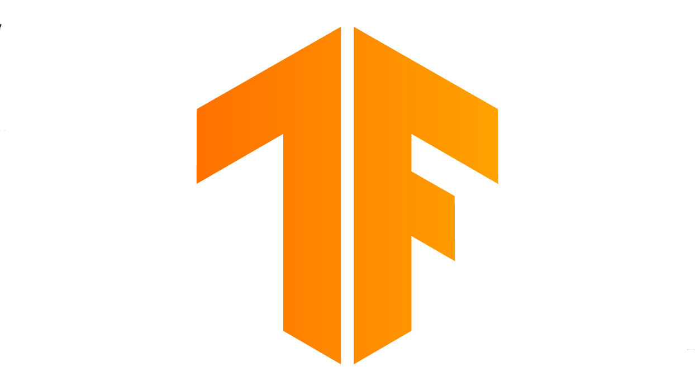
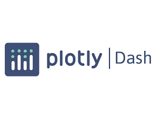

<!-- Social icons section -->
<h1 align="center"> My Social Media: </h1>
  

    
    
    
  

</h1>

<!-- Description about me -->
<h2 align="center"> 🤔 About me 👨‍💻 </h2>

Hey!  
I am <b>Shrawan Sai Malyala</b> from <strong>Hyderabad, India</strong> 
I'm a recent graduate from Vellore Institute of Technology from where I have done my bachelor's in computer science.  
I really love developing software that involves Machine Learning and AI. Natural Language Processing is my favourite field of techonology  
I currently work in Novartis Healthcare as a full stack developer in the Medical Imaging team 
Contact me for new projects 📨, I am open for collaborations   

### 🧐 More About Me:

- 🔭 &nbsp; I’m currently working on **Autoencoders for Medical Images**
- 🤝 &nbsp; I’m looking to collaborate on Open Source Projects
- 🌱 &nbsp; I’m currently learning Pytorch; 
- 📫 &nbsp; Feel free to contact me on [LinkedIn](http://www.linkedin.com/in/shrawans)
- 🎷 &nbsp; In my free time, I love listening to my favourite music

  
 
<!-- GitHub stats section -->

## 📊 Github stats

   
  
  
   

   
<h1 align="center"> Languages/Frameworks I'm good at: </h1>

<code></code>
  <code></code>
  <code></code>
  <code></code>
  <code></code>
  <code></code>
  <code></code>
  <code></code>

 
<h1 align="center"> Languages/Frameworks I'm learning: </h1>

  <code></code>
  <code></code>
  <code></code>

 

<h1 align="center"> Environments I work with: </h1>

  <code></code>
  <code></code>
  <code></code>
  <code></code>

 

 

<h1 align="center"> My Certifications and courses: </h1>

  <ul>
  <li><a href="https://aws.amazon.com/certification/certified-cloud-practitioner/">AWS Certified Cloud Practitioner (03/2020 – 03/2023)</a></li>
  <li>Microsoft Technology Associate for Python Programming (2018)</li>
  <li>Completed course on “Linux for Developers” on, Coursera (2021)</li>
  <li>Completed course on “TensorFlow for Artificial Intelligence and Deep Learning” on, Coursera (2020)</li>
  <li>Completed course on “Full Stack Website Development with Django” on Udemy (2020)</li>
  <li>Completed course on “Modern Natural Language Processing” in Udemy (2020)</li>
  <li>Applied Machine Learning with Python- VIT Value Added Program (2019)</li>
  </ul>
  

 

